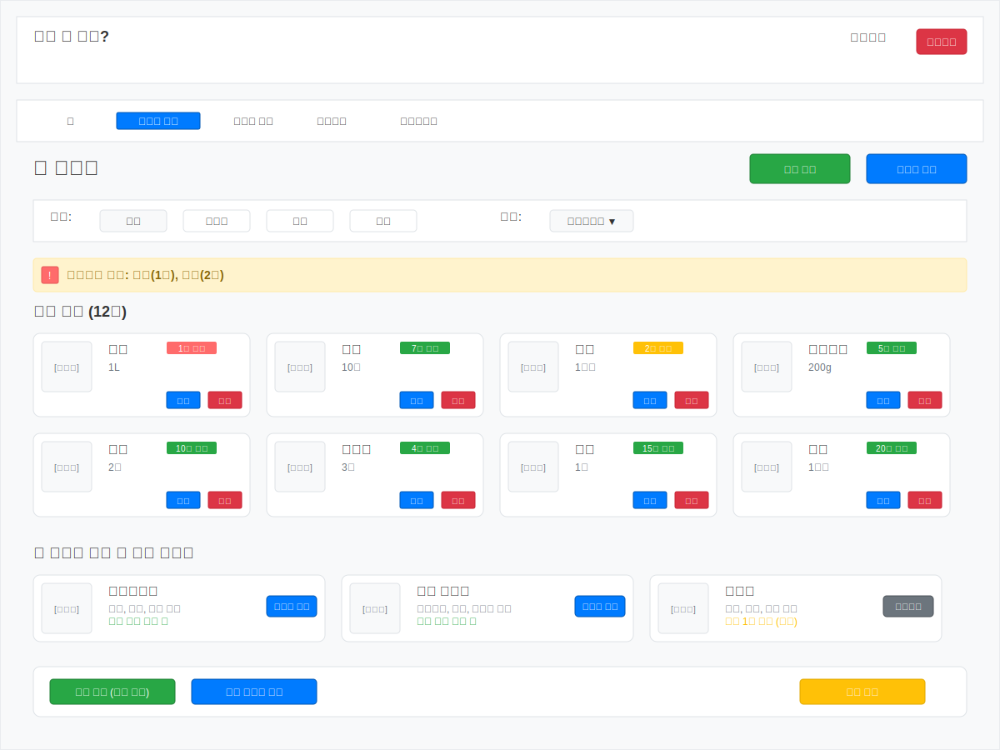

# UX 와이어프레임

냉장고 요리 레시피 추천 웹 애플리케이션 "오늘 뭐 먹지?"의 웹 UX 와이어프레임입니다.

## 1. 홈페이지 (Home Page)

### 주요 구성 요소

- **헤더**: 브랜드 로고, 로그인/회원가입 버튼
- **네비게이션**: 홈, 냉장고 관리, 레시피 검색, 커뮤니티, 마이페이지
- **히어로 섹션**: 메인 검색바와 브랜드 메시지
- **빠른 시작 카드**: 재료 등록, 레시피 추천, 커뮤니티, 통계
- **오늘의 추천 레시피**: 개인화된 레시피 카드 목록

### 핵심 기능

- 재료 기반 레시피 검색
- 빠른 액션 버튼을 통한 주요 기능 접근
- 개인화된 레시피 추천 표시

## 2. 냉장고 관리 페이지 (Fridge Management)

### 주요 구성 요소

- **페이지 제목 및 액션**: 재료 추가, 바코드 스캔 버튼
- **필터/정렬 옵션**: 카테고리별 필터, 유통기한순 정렬
- **유통기한 알림**: 임박한 재료에 대한 경고 표시
- **재료 그리드**: 보유 재료 카드 목록 (이미지, 수량, 유통기한, 액션)
- **레시피 제안**: 현재 재료로 만들 수 있는 레시피
- **하단 액션**: 일괄 삭제, 쇼핑 리스트 생성, 알림 설정

### 핵심 기능

- 재료 CRUD 관리
- 유통기한 기반 알림 시스템
- 보유 재료 기반 레시피 추천
- 카테고리별 필터링 및 정렬

## 3. 레시피 상세 페이지 (Recipe Detail)

### 주요 구성 요소

- **레시피 헤더**: 대표 이미지, 제목, 평점, 기본 정보
- **액션 버튼**: 북마크, 공유, 재료 구매
- **재료 목록**: 필요한 재료와 보유 현황 표시
- **조리 순서**: 단계별 상세 가이드
- **요리 팁**: 셰프의 노하우 및 팁
- **영양 정보**: 칼로리, 영양소 정보
- **리뷰 섹션**: 사용자 후기 및 평점

### 핵심 기능

- 재료 보유 현황 실시간 확인
- 단계별 요리 가이드
- 부족한 재료 구매 링크 제공
- 커뮤니티 리뷰 시스템

## 4. 커뮤니티 페이지 (Community)

### 주요 구성 요소

- **페이지 액션**: 후기 작성, 레시피 공유 버튼
- **필터 탭**: 전체, 인기 후기, 새 레시피, 질문, 팁 공유
- **검색 기능**: 커뮤니티 콘텐츠 검색
- **인기 후기**: 사용자 요리 후기 카드
- **새로운 레시피**: 사용자 제작 레시피 목록
- **Q&A 섹션**: 질문과 답변 목록
- **요리 팁**: 실용적인 요리 노하우

### 핵심 기능

- 사용자 간 요리 경험 공유
- 레시피 평점 및 리뷰 시스템
- Q&A 질문/답변 기능
- 요리 팁 및 노하우 공유

## 디자인 가이드라인

### 색상 스키마

- **Primary**: #007bff (파란색) - 주요 액션 버튼
- **Success**: #28a745 (녹색) - 성공, 보유 재료 표시
- **Warning**: #ffc107 (노란색) - 주의, 유통기한 임박
- **Danger**: #dc3545 (빨간색) - 삭제, 긴급 알림
- **Background**: #f8f9fa (연한 회색) - 페이지 배경
- **Card**: #ffffff (흰색) - 카드 배경

### 레이아웃 원칙

- **1200px 고정 너비**: 데스크톱 최적화
- **8px 그리드 시스템**: 일관된 간격
- **카드 기반 디자인**: 명확한 정보 구분
- **Bootstrap 스타일**: 친숙한 UI 패턴 활용

### 반응형 고려사항

- 모바일 우선 접근법
- 태블릿에서의 터치 친화적 인터페이스
- 다양한 화면 크기 대응

## 사용자 경험 (UX) 원칙

### 직관성

- 명확한 네비게이션 구조
- 일관된 버튼 배치
- 시각적 피드백 제공

### 효율성

- 빠른 액션 버튼
- 스마트 검색 및 필터링
- 원클릭 주요 기능 접근

### 접근성

- 충분한 색상 대비
- 명확한 텍스트 라벨
- 키보드 네비게이션 지원

### 개인화

- 사용자 맞춤 추천
- 보유 재료 기반 컨텐츠
- 개인 취향 반영
